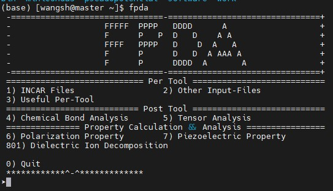

## Description
This software features a user-friendly interface and implements a streamlined processing of VASP input and output files using Bash and Python languages. It includes modules for generating input files, extracting results, and analyzing properties, enabling convenient and efficient extraction of polarization intensity, dielectric constants, piezoelectric stress/strain constants, and other properties for ferroelectric materials. By offering a systematic analysis of these physical properties from the atomic and phononic scales, it significantly reduces the workload for users and improves the efficiency of property analysis for ferroelectric materials.

## Installation
1. To prepare the installation package in the Linux home directory (cd ~) and extract it with the decompression command (tar zxvf FPDA.0.0.1 .tar.gz) to preserve file permissions.
2. 
```
cd FPDA.0.0.1 
sh install.sh
```
Afterwards, follow the prompts to select your installation path.

3. 
```
source ~/.bashrc
```

## Usage
Upon entering 'fpda' in the command line, if the installation is successful, you will see the following interface:


Enter the corresponding number to invoke the relevant function.

**NOTE**: In order to guarantee the stable operation of the software, please see the '[requirements.docx](./requirements.docx)' file.


## Authors
[Gang Tang](https://github.com/obaica)

Shihao Wang

Zunyi Deng

[Jiawang Hong](https://sae.bit.edu.cn/szdw20/szml/lxcx20/zgjzcapypx_3/b187464.htm)

## How to cite
1. S. Wang, Z. Deng, S. Li, P. Lv, J. Wang, X. Wang, G. Tang, and J. Hong, First-principles insights into the ferroelectric, dielectric, and piezoelectric properties of polar Pca2<sub>1</sub> SbN, [Phys. Rev. B 108, 174110 (2023)](https://journals.aps.org/prb/abstract/10.1103/PhysRevB.108.174110).
2. Xian Zi, Zunyi Deng, Lixiang Rao, Yongheng Li, Gang Tang, and Jiawang Hong, First-principles study of ferroelectric, dielectric, and piezoelectric properties in the nitride perovskites Ce⁢𝐵⁢N<sub>3</sub> (𝐵 = Nb, Ta), [Phys. Rev. B 109, 115125 (2024)]([https://doi.org/10.1103/PhysRevB.109.115125)).
